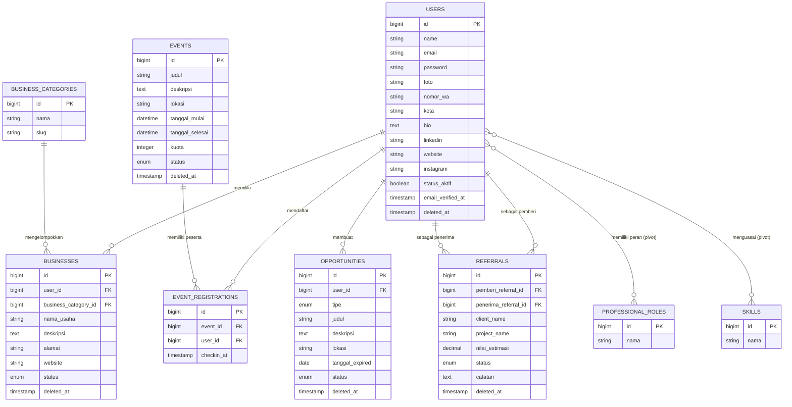

# KPMI Pekalongan — Rancangan Arsitektur Aplikasi (Tahap 1)

Stack: **Laravel 13** + **MariaDB** + **Orchid Platform** (admin dashboard) + Eloquent + Repository Pattern seperlunya.
Target deploy: Shared Hosting & VPS Linuxid.

> Catatan versi: pastikan `orchid/platform` minimal versi **^14.53** — dukungan resmi Laravel 13.x baru masuk di rilis tersebut. Cek `composer show orchid/platform` di project kamu; kalau masih di bawah itu, jalankan `composer update orchid/platform`.

Sesuai instruksi di dokumen kebutuhan (petunjuk.odt): tahap ini **hanya desain**, belum menulis seluruh source code. Setelah kamu setujui/koreksi bagian di bawah, kita lanjut implementasi modul per modul mulai dari Authentication → Member Directory → modul lainnya.

---

## 1. Analisis Kebutuhan

### 1.1 Konteks Aplikasi
Platform komunitas untuk **KPMI (Komunitas Pengusaha Muslim Indonesia) chapter Pekalongan**. Fokus: networking, kolaborasi, referral, direktori anggota, event komunitas. **Bukan** marketplace, **bukan** media sosial.

### 1.2 Dua Jenis "Role" — Penting, Jangan Tertukar
Dokumen kebutuhan menyebut dua konsep berbeda yang sama-sama disebut "role":

| Jenis | Contoh nilai | Fungsi | Implementasi |
|---|---|---|---|
| **Role Sistem** (hak akses) | Administrator, Pengurus, Anggota | Menentukan apa yang boleh dikelola di aplikasi | Orchid Role & Permission (bawaan Orchid, guard `platform`/`web`) |
| **Role Profesi** (identitas bisnis) | Pengusaha, Freelancer, Konsultan, Mentor, dst | Data profil, murni informasi, tidak memengaruhi hak akses | Tabel `professional_roles` + pivot many-to-many |

**Revisi:** Semua role sistem (Administrator, Pengurus, **maupun Anggota**) login lewat **satu Panel Orchid yang sama**. Yang membedakan pengalaman tiap role bukan area terpisah, melainkan **menu & permission**: Administrator/Pengurus melihat Screen "Semua Anggota", "Semua Usaha", "Semua Peluang", dst.; Anggota hanya melihat Screen self-service ("Profil Saya", "Usaha Saya", "Peluang Saya", "Event Saya") yang query-nya di-scope ke `Auth::id()`. Detail lengkap di poin 1.3 bagian "Pembagian Area".

### 1.3 Keputusan Desain Kunci (mohon dikonfirmasi sebelum coding)

1. **Tabel `members` digabung ke tabel `users` bawaan** (ditambah kolom profil: foto, nomor_wa, kota, bio, linkedin, website, instagram, status_aktif). Ini pola standar Orchid — satu identitas dipakai baik untuk login Member Area maupun Panel Admin (Pengurus/Administrator). *Alternatif: tabel `members` terpisah 1-1 dari `users`, tapi ini menambah kompleksitas tanpa manfaat jelas di kasus ini.*
2. **Pembagian Area (revisi):**
   - **Admin Area + Member Area = satu Panel Orchid** (prefix `/admin`, bisa diganti lewat `config/platform.php` kalau kamu mau prefix yang terasa lebih netral buat anggota biasa, mis. `/portal` — tinggal ganti 1 baris config, kabari saja kalau mau ini).
   - **Public Area = Laravel MVC murni** (Route Group, Resource Controller, Blade + Bootstrap 5): Homepage, Direktori Anggota, Direktori Usaha, Event Publik, Detail Anggota, Detail Usaha, **+ halaman Registrasi** (karena mendaftar akun harus bisa diakses tamu, sedangkan Orchid tidak menyediakan form sign-up publik bawaan).
   - **Login cukup satu** — pakai halaman login bawaan Orchid (`/admin/login`), berlaku untuk Administrator, Pengurus, maupun Anggota. Tidak ada login terpisah di Public Area.
   - Konsekuensi: **setiap user baru (termasuk Anggota) tetap diberi Orchid Role** ("Anggota") supaya rapi dikelola & bisa dibedakan lewat permission — bukan lagi "Anggota tanpa role" seperti draf sebelumnya.
   - Screen admin (kelola semua data) **wajib** dipasangi `->permission('platform.xxx')` supaya otomatis tersembunyi dari Anggota. Screen self-service (punya Anggota sendiri) tidak perlu permission khusus, cukup di-scope query-nya ke `Auth::id()` di dalam Screen.
3. **Kenapa bukan Member=Orchid+Public=Orchid sekalian, atau semua MVC?** Halaman Public (direktori, homepage) harus bisa diakses tamu tanpa login dan idealnya SEO-friendly/branding bebas — ini di luar kekuatan Orchid (Screen selalu terikat chrome & guard panel). Sebaliknya, menyatukan Admin+Member di Orchid menghemat banyak waktu dev (form, tabel, filter, pagination otomatis) dan sudah sesuai concern kamu soal konsistensi tooling — trade off-nya, tampilan Member Area akan mengikuti gaya panel Orchid, bukan custom Bootstrap 5.
4. **Repository Pattern "seperlunya"** → direkomendasikan dipakai hanya untuk query lintas-modul/kompleks (agregasi Dashboard, Search & Filter Direktori/Opportunities). Modul CRUD sederhana (Business, Opportunity, Skill, dll.) cukup Eloquent langsung di Service Layer — supaya tidak over-engineering di aplikasi berskala chapter lokal.
5. **Soft Delete** diterapkan di data utama: `users`, `businesses`, `opportunities`, `referrals`, `events`. Tabel pivot dan `event_registrations` tidak perlu (sesuai catatan "riwayat usaha tetap tersimpan meski non aktif" di dokumen — soft delete + kolom status yang menangani ini).
6. **[Dikonfirmasi]** Kategori usaha dijadikan **master data terstruktur** (`business_categories`, dikelola via Orchid Screen), bukan input teks bebas — konsisten dengan pola `professional_roles`/`skills`, dan membuat **Filter Usaha > Kategori** (FITUR PENCARIAN) konsisten karena tidak bergantung ketikan bebas tiap anggota. Seed awal: Kuliner, Fashion Muslim, Perdagangan/Retail, Jasa & Konsultasi, Teknologi & Digital, Pendidikan & Pelatihan, Kesehatan & Kecantikan, Keuangan Syariah, Pertanian & Perikanan, Konstruksi & Properti, Otomotif. Sesuaikan daftarnya nanti saat Modul Businesses dikerjakan (Fase 4).
7. **[Dikonfirmasi — revisi]** **Admin Area *dan* Member Area sama-sama dibangun dengan Orchid Screens** dalam **satu panel yang sama** (bukan Admin=Orchid, Member=Blade seperti draf awal). Hanya **Public Area** yang tetap Laravel MVC murni. Detail & alasannya di poin 1.3 bagian "Pembagian Area" di bawah.

### 1.4 Rekap Modul
M1 Member Directory · M2 Roles Profesi (m2m) · M3 Skill & Layanan (m2m) · M4 Businesses (1-N) · M5 Opportunities Board (Need/Offer/Collaborate) · M6 Referral (antar anggota) · M7 Event · M8 Pendaftaran Event (unique per anggota per event) · M9 Dashboard (Admin & Anggota) + Search/Filter.

---

## 2. Entity Relationship Diagram (ERD)



Role sistem (Administrator/Pengurus) tidak digambar sebagai entity terpisah karena dikelola oleh tabel bawaan Orchid (`roles`, dan tabel pivot-nya) yang otomatis dibuat oleh `php artisan orchid:install`.

---

## 3. Struktur Folder (Laravel 13 skeleton — tanpa `Kernel.php`, middleware didaftarkan di `bootstrap/app.php`)

```
app/
├── Console/
│   └── Commands/
├── Http/
│   ├── Controllers/
│   │   ├── Auth/
│   │   │   └── RegisteredUserController.php   (registrasi publik — login tetap pakai Orchid)
│   │   └── Public/
│   │       ├── HomeController.php
│   │       ├── MemberDirectoryController.php
│   │       ├── BusinessDirectoryController.php
│   │       └── EventController.php
│   ├── Requests/
│   │   └── Auth/RegisterRequest.php
│   └── Middleware/
│       └── EnsureMemberIsActive.php   (didaftarkan di config/platform.php, bukan routes/web.php)
├── Models/
│   ├── User.php
│   ├── ProfessionalRole.php
│   ├── Skill.php
│   ├── BusinessCategory.php
│   ├── Business.php
│   ├── Opportunity.php
│   ├── Referral.php
│   ├── Event.php
│   └── EventRegistration.php
├── Orchid/
│   ├── Screens/
│   │   ├── Dashboard/DashboardScreen.php          (beda widget per role: Admin vs Anggota)
│   │   ├── User/{UserListScreen,UserEditScreen}.php        [admin, ->permission()]
│   │   ├── Business/BusinessListScreen.php                 [admin: semua usaha, ->permission()]
│   │   ├── Business/MyBusinessScreen.php                   [anggota: usaha sendiri, di-scope Auth::id()]
│   │   ├── Opportunity/OpportunityListScreen.php           [admin]
│   │   ├── Opportunity/MyOpportunityScreen.php             [anggota]
│   │   ├── Referral/ReferralListScreen.php                 [admin]
│   │   ├── Event/{EventListScreen,EventEditScreen}.php     [admin/pengurus, ->permission()]
│   │   ├── Event/MyEventScreen.php                         [anggota: "Event Saya"]
│   │   ├── Profile/ProfileScreen.php                       [semua role: kelola profil sendiri]
│   │   ├── ProfessionalRole/ProfessionalRoleListScreen.php [admin]
│   │   ├── Skill/SkillListScreen.php                       [admin]
│   │   └── BusinessCategory/BusinessCategoryListScreen.php [admin]
│   ├── Layouts/
│   └── Filters/
├── Policies/
│   ├── BusinessPolicy.php
│   ├── OpportunityPolicy.php
│   ├── EventPolicy.php
│   └── ReferralPolicy.php
├── Services/
│   ├── MemberDirectoryService.php
│   ├── BusinessService.php
│   ├── OpportunityService.php
│   ├── ReferralService.php
│   ├── EventService.php
│   └── DashboardService.php
└── Repositories/
    ├── Contracts/
    │   ├── MemberRepositoryInterface.php
    │   └── DashboardRepositoryInterface.php
    └── Eloquent/
        ├── MemberRepository.php
        └── DashboardRepository.php

database/
├── migrations/
├── seeders/
└── factories/

resources/views/
├── layouts/        (Bootstrap 5, dipakai Public Area saja)
└── public/

routes/
├── web.php         (Public Area + Registrasi)
└── platform.php    (Orchid Screens — Admin & Member Area jadi satu di sini)
```

---

## 4. Daftar Migration

| # | Tabel | Kolom penting | Catatan |
|---|---|---|---|
| 1 | `users` (modifikasi, migration tambahan) | + foto, nomor_wa, kota, bio, linkedin, website, instagram, status_aktif (bool, default true) | + soft deletes |
| 2 | `professional_roles` | id, nama | master data |
| 3 | `professional_role_user` | user_id FK, professional_role_id FK | unique(user_id, professional_role_id) |
| 4 | `skills` | id, nama | master data |
| 5 | `skill_user` | user_id FK, skill_id FK | unique(user_id, skill_id) |
| 6a | `business_categories` | id, nama, slug | master data, dikelola Admin/Pengurus |
| 6 | `businesses` | user_id FK, business_category_id FK, nama_usaha, deskripsi, alamat, website, status enum(aktif,non_aktif) | soft deletes; index(user_id), index(business_category_id) |
| 7 | `opportunities` | user_id FK, tipe enum(need,offer,collaborate), judul, deskripsi, lokasi, tanggal_expired, status enum(draft,published,closed) | soft deletes; index(tipe,status) |
| 8 | `referrals` | pemberi_referral_id FK(users), penerima_referral_id FK(users), client_name, project_name, nilai_estimasi decimal(15,2), status enum(introduced,follow_up,negotiation,won,lost), catatan | soft deletes |
| 9 | `events` | judul, deskripsi, lokasi, tanggal_mulai, tanggal_selesai, kuota, status enum(draft,published,finished) | soft deletes |
| 10 | `event_registrations` | event_id FK, user_id FK, checkin_at | unique(event_id, user_id) |
| — | `roles`, dll. (bawaan Orchid) | dibuat otomatis oleh `orchid:install` | 3 role: Administrator, Pengurus, **Anggota** (baru — sebelumnya Anggota tidak diberi role) |

---

## 5. Daftar Model & Relasi (signature saja, implementasi menyusul di tahap coding)

- **User** (extends model dasar Orchid, pakai trait `Access\UserAccess`)
  `businesses(): HasMany` · `opportunities(): HasMany` · `eventRegistrations(): HasMany` · `events(): BelongsToMany` (via `event_registrations`) · `professionalRoles(): BelongsToMany` · `skills(): BelongsToMany` · `referralsGiven(): HasMany` (`pemberi_referral_id`) · `referralsReceived(): HasMany` (`penerima_referral_id`)
- **ProfessionalRole**: `users(): BelongsToMany`
- **Skill**: `users(): BelongsToMany`
- **BusinessCategory**: `businesses(): HasMany`
- **Business**: `user(): BelongsTo` · `category(): BelongsTo` (`business_category_id`)
- **Opportunity**: `user(): BelongsTo`
- **Referral**: `pemberi(): BelongsTo(User::class,'pemberi_referral_id')` · `penerima(): BelongsTo(User::class,'penerima_referral_id')`
- **Event**: `registrations(): HasMany` · `participants(): BelongsToMany(User::class,'event_registrations')->withPivot('checkin_at')`
- **EventRegistration**: `event(): BelongsTo` · `user(): BelongsTo`

---

## 6. Rencana Implementasi Bertahap

0. Setup: pastikan `orchid/platform` ^14.53+, `php artisan orchid:install`, seed Role sistem (Administrator, Pengurus, **Anggota**), tambahkan `EnsureMemberIsActive` ke middleware `private` di `config/platform.php`.
1. **Authentication** — halaman Registrasi publik (Laravel MVC) yang otomatis assign Role "Anggota" lalu redirect ke Panel Orchid; Login/Logout pakai bawaan Orchid, tidak perlu kode tambahan.
2. **Member Directory** (Modul 1) — Screen "Profil Saya" (semua role, self-service) di Panel Orchid + halaman Direktori & Detail Anggota publik (Laravel MVC).
3. **Roles Profesi & Skill** (Modul 2 & 3) — master data via Screen admin; assign ke member lewat Screen "Profil Saya".
4. **Businesses** (Modul 4) — Screen "Usaha Saya" (anggota, scope `Auth::id()`) + Screen "Semua Usaha" (admin/pengurus) + Direktori Usaha publik.
5. **Opportunities Board** (Modul 5) — pola sama: Screen "Peluang Saya" vs Screen admin.
6. **Referral** (Modul 6) — Screen di Panel Orchid (admin lihat semua, anggota lihat referral yang melibatkan dirinya).
7. **Event & Pendaftaran Event** (Modul 7 & 8) — Screen admin kelola Event, Screen "Event Saya" untuk anggota daftar/lihat status; Event Publik tetap Laravel MVC.
8. **Dashboard** (Modul 9) — satu DashboardScreen dengan widget berbeda per role (Admin: statistik global; Anggota: ringkasan pribadi) + Search/Filter semua modul (publik & di dalam Screen Orchid).
9. Hardening: seeder/factory lengkap, index, policy/permission review, persiapan deploy shared hosting & VPS Linuxid.

---

## 7. Status Konfirmasi

- [x] `members` digabung ke `users` — **disetujui**.
- [x] Repository Pattern hanya di Dashboard & Search/Filter — **disetujui**.
- [x] Kategori usaha jadi master data (`business_categories`) — **disetujui, ditambahkan**.
- [x] Upload foto/attachment pakai **Orchid Attachment** bawaan — **disetujui**.
- [x] **Admin Area + Member Area disatukan di Panel Orchid**, Public Area tetap Laravel MVC — **disetujui** (revisi dari draf awal).

Desain Tahap 1 disetujui. Lanjut ke **implementasi Fase 1 — Authentication**.
